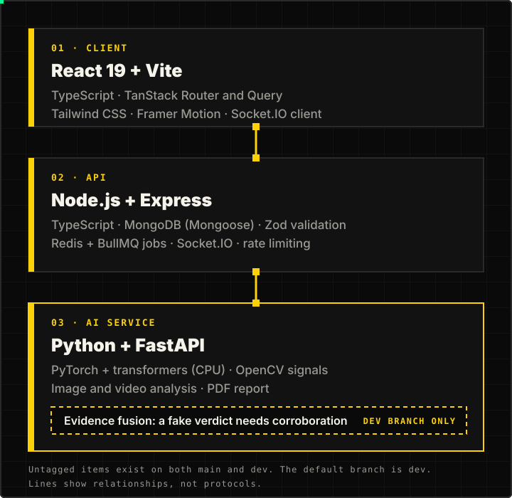

<h1></h1>

**Muhammad Hassan Baig** · Full-Stack AI Engineer

Engineering AI-powered products, reliable backend systems and intelligent developer tools.

[Portfolio](https://hassan-baigo-portfolio.vercel.app/) · [TrueVibe](#truevibe-a-case-study) · [Wakeel](https://github.com/baigcoder/lawyer-agency) · [HIRE.OS](https://github.com/baigcoder/hire-os) · [Repositories](https://github.com/baigcoder?tab=repositories)

I work across the stack: React and Next.js interfaces, Node.js and TypeScript backends, and the data, queue and AI layers behind them. What interests me most is the unglamorous engineering that makes AI features trustworthy: validated model output, idempotent queues, tenant isolation, and graceful degradation when a provider fails.

## Selected engineering work

### TrueVibe: a case study

**Problem.** On social platforms, manipulated media is easy to post and hard to judge. TrueVibe is built around one question: can you trust what you're looking at?

**Approach.** Uploaded media goes to a separate Python service that produces a trust verdict, so the interface can show authenticity signals instead of leaving users to guess. Real-time features run on the Node API.

**Engineering contribution.** On the `dev` branch, an evidence-fusion step only supports a "fake" verdict when independent forensic signals (FFT, eye, colour and noise, edge, mouth, temporal) corroborate the primary model's score. The aim is that no single over-confident model decides alone. That module is **not on `main`**.

**Stack, verified in the repository.**
- *Client:* React 19, Vite, TypeScript, TanStack Router and Query, Tailwind CSS, Framer Motion.
- *API:* Node.js, Express, MongoDB, Redis with BullMQ, Socket.IO, Zod, Helmet.
- *AI service:* FastAPI, PyTorch and `transformers` (CPU build), OpenCV, image and video analysis, PDF report.
- *Delivery:* Docker Compose, GitHub Actions CI, Vercel and Railway configuration.

**Status, stated plainly.** I built this myself. I haven't published accuracy numbers or benchmarks, and the repository has no Kubernetes manifests. I don't claim production traffic, horizontal scaling or security guarantees. The live-app link comes from the repository's metadata.

[Source](https://github.com/baigcoder/TrueVibe) · [Live app](https://true-vibe.vercel.app/) · [Changelog](https://github.com/baigcoder/TrueVibe/blob/HEAD/CHANGELOG.md)

### Wakeel

**Problem.** Pakistani law firms run intake, fees and documents through WhatsApp, and partners re-read long chats. 
**Approach.** A multi-tenant WhatsApp front desk where an AI handles intake, scheduling and document requests, then hands a structured brief to a lawyer. It never gives legal advice, and a web dashboard serves the staff. 
**Contribution.** PostgreSQL row-level security with `FORCE`; ack-fast webhooks with idempotent queue consumers; per-conversation locking; a deterministic fallback for every model call; and Urdu and Roman Urdu handling for voice replies. 
**Stack.** TypeScript, NestJS, Next.js, PostgreSQL with pgvector, Redis, BullMQ, Prisma. 
**Status.** Phases 1–15 are in the repository. Its README lists hosting, backups and alerting as next steps, so I don't present it as deployed.

[Source](https://github.com/baigcoder/lawyer-agency)

### HIRE.OS

**Problem.** Hiring spans resume screening, assessment and interviewing, usually across separate tools. 
**Approach.** One platform with a resume analyser, AI-generated assessments with proctoring signals, WebRTC interviews, and recruiter and candidate dashboards. 
**Contribution.** Per-feature model selection with a fallback model, and live dashboards on Supabase Realtime. 
**Stack.** React, Node.js, Express, MongoDB, Redis, Supabase.

[Source](https://github.com/baigcoder/hire-os) · [Demo](https://hire-os.vercel.app) (link taken from the project README)

### Also built

- **[Rivulet](https://github.com/baigcoder/rivulet):** a media library and BitTorrent player for desktop and Android TV with an embedded mpv, an in-process torrent engine and a TV-remote-first UI. TypeScript. [Site](https://rivulet-beige.vercel.app)
- **[Brewns](https://github.com/baigcoder/brewns):** a specialty coffee house site with Next.js 16, three.js product views and a thermal-receipt ordering flow. [Live](https://brewns-chi.vercel.app)

## Technical stack

Used in my projects:

| Area | Tools |
| --- | --- |
| Languages and frontend | TypeScript, JavaScript, Python, SQL; React, Next.js, Vite, Tailwind CSS, TanStack Query and Router, Framer Motion, three.js |
| Backend and APIs | Node.js, Express, NestJS, REST, Socket.IO, WebRTC, Zod |
| Databases and caching | PostgreSQL (RLS, pgvector), MongoDB, Redis, BullMQ, Prisma, Mongoose, Supabase |
| Applied AI and LLMs | OpenAI-compatible and Gemini APIs, RAG with pgvector, PyTorch and `transformers` inference, FastAPI model services, speech-to-text and text-to-speech |
| Infrastructure and automation | Docker and Compose, nginx, GitHub Actions, Vercel, Railway |

Still learning, so not claimed as experience: LangGraph, CrewAI, MCP, Unsloth, Kubernetes, AWS.

## Engineering focus

- **Agents and orchestration:** LangGraph, CrewAI, and MCP servers.
- **LLM applications:** retrieval quality, evaluation, and fine-tuning with Hugging Face and Unsloth.
- **Distributed systems:** event-driven design, queues and idempotency.
- **Platform:** Kubernetes and AWS, plus developer automation.

> Understand the problem → Design the system → Implement → Test → Deploy → Observe → Improve

## GitHub activity

<picture>
  <source media="(prefers-color-scheme: dark)" srcset="https://raw.githubusercontent.com/baigcoder/baigcoder/output/github-contribution-grid-snake-dark.svg">
  
</picture>

## Contact

Open to collaborating on AI products, SaaS, backend engineering, developer tooling and open source. Reach me through my [portfolio](https://hassan-baigo-portfolio.vercel.app/) or an issue on any repository above.

<!-- Add a verified LinkedIn URL and public email here when ready. -->

Built with intent: real software, honest engineering, better systems each time.

