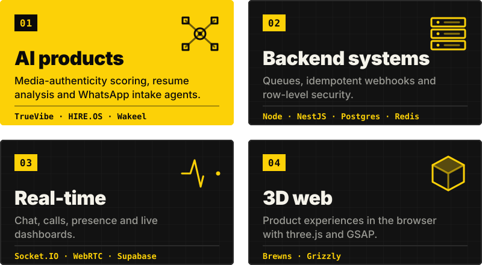
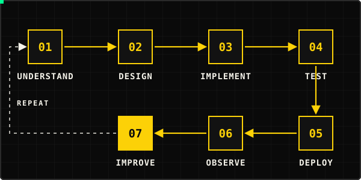

<div align="center">

<h1>
<picture>
  <source media="(max-width: 640px)" srcset="https://raw.githubusercontent.com/baigcoder/baigcoder/main/assets/profile-hero-mobile.svg">
  
</picture>
</h1>

**Muhammad Hassan Baig** · Full-Stack AI Engineer · Lahore, Pakistan

Engineering AI-powered products, reliable backend systems and intelligent developer tools.

<a href="https://github.com/baigcoder"></a>
<a href="https://www.linkedin.com/in/hassan-baig-672778111/"></a>
<a href="https://hassan-baigo-portfolio.vercel.app/"></a>
<a href="https://hassan-baigo-portfolio.vercel.app/blogs"></a>
<a href="https://hassan-baigo-portfolio.vercel.app/api/cv"></a>

[Best work](#best-work) · [TrueVibe case study](#truevibe-a-case-study) · [How I build](#how-i-build) · [Live stats](#github-live) · [Contact](#contact)

[](https://github.com/baigcoder/lawyer-agency/commits)
[](https://github.com/baigcoder/grizzly/commits)
[](https://github.com/baigcoder/brewns/commits)


</div>

I work across the stack: React and Next.js interfaces, Node.js and TypeScript backends, and the data, queue and AI layers behind them. What interests me most is the unglamorous engineering that makes AI features trustworthy: validated model output, idempotent queues, tenant isolation, and graceful degradation when a provider fails.

```ts
const hassan = {
  role: "Full-Stack AI Engineer",
  based: "Lahore, Pakistan",
  stack: ["TypeScript", "React", "Next.js", "Node.js", "PostgreSQL", "MongoDB", "Redis"],
  recently: ["Wakeel", "Grizzly", "Brewns", "Rivulet"],
  exploring: ["LangGraph", "CrewAI", "MCP", "Kubernetes", "AWS"],
  principles: ["validate model output", "idempotent by default", "degrade gracefully"],
  openTo: ["AI products", "SaaS", "backend engineering", "developer tooling", "open source"],
} as const;
```

## What I build

<div align="center">

</div>

## Best work

<div align="center">
<a href="https://github.com/baigcoder/TrueVibe"></a>
<a href="https://github.com/baigcoder/lawyer-agency"></a>
<a href="https://github.com/baigcoder/hire-os"></a>
<a href="https://github.com/baigcoder/rivulet"></a>
<a href="https://github.com/baigcoder/brewns"></a>
<a href="https://github.com/baigcoder/grizzly"></a>
</div>

| Project | Source | Live link |
| --- | --- | --- |
| TrueVibe | [baigcoder/TrueVibe](https://github.com/baigcoder/TrueVibe) | [true-vibe.vercel.app](https://true-vibe.vercel.app/) |
| Wakeel | [baigcoder/lawyer-agency](https://github.com/baigcoder/lawyer-agency) | none yet |
| HIRE.OS | [baigcoder/hire-os](https://github.com/baigcoder/hire-os) | [hire-os.vercel.app](https://hire-os.vercel.app) |
| Rivulet | [baigcoder/rivulet](https://github.com/baigcoder/rivulet) | [rivulet-beige.vercel.app](https://rivulet-beige.vercel.app) |
| Brewns | [baigcoder/brewns](https://github.com/baigcoder/brewns) | [brewns-chi.vercel.app](https://brewns-chi.vercel.app) |
| Grizzly | [baigcoder/grizzly](https://github.com/baigcoder/grizzly) | none listed |

Cards marked "screenshot" use images from each repository. Cards marked "sketch" are diagrams I drew from the project's code or README, not screenshots. Live links come from repository metadata or READMEs, and I haven't load-tested or benchmarked any of these.

### More builds

- **[CreatorVerse](https://github.com/baigcoder/creatorverse):** full-stack creator learning platform. [Live](https://creatorverse-web-two.vercel.app)
- **[Nexus POS](https://github.com/baigcoder/nexus-pos):** point-of-sale app in TypeScript. [Live](https://nexus-pos-nine.vercel.app)
- **[Pure CV Builder](https://github.com/baigcoder/pure-cv-builder):** CV builder in TypeScript. [Live](https://pure-cv-builder-frontend.vercel.app)
- **[Shopping Expense Tracker](https://github.com/baigcoder/shopping-expense-tracker):** expense tracker in TypeScript. [Live](https://shopping-expense-trackerfrontend.vercel.app)
- **[Humza Portfolio](https://github.com/baigcoder/humza-portfolio):** corporate financial advisory site. [Live](https://humza-portfolio-xi.vercel.app)
- **[Pakistan Luxury Dresscode](https://github.com/baigcoder/pakistan-luxury-dresscode):** TypeScript web app. [Live](https://pakistan-luxury-dresscode.vercel.app)

<div align="center">

</div>

## TrueVibe: a case study

<div align="center">
<a href="https://github.com/baigcoder/TrueVibe"></a>
</div>

**Problem.** On social platforms, manipulated media is easy to post and hard to judge. TrueVibe is built around one question: can you trust what you're looking at?

**Approach.** Uploaded media goes to a separate Python service that produces a trust verdict, so the interface can show authenticity signals instead of leaving users to guess. Real-time features run on the Node API.

**Engineering contribution.** On the repository's default `dev` branch, an evidence-fusion step only supports a "fake" verdict when independent forensic signals (FFT, eye, colour and noise, edge, mouth, temporal) corroborate the primary model's score. The aim is that no single over-confident model decides alone. That module has not been merged to `main`.

**Stack, verified in the repository.**
- *Client:* React 19, Vite, TypeScript, TanStack Router and Query, Tailwind CSS, Framer Motion.
- *API:* Node.js, Express, MongoDB, Redis with BullMQ, Socket.IO, Zod, Helmet.
- *AI service:* FastAPI, PyTorch and `transformers` (CPU build), OpenCV, image and video analysis, PDF report.
- *Delivery:* Docker Compose, GitHub Actions CI, Vercel and Railway configuration.

**Status, stated plainly.** I built this myself. I haven't published accuracy numbers or benchmarks, and the repository has no Kubernetes manifests. I don't claim production traffic, horizontal scaling or security guarantees.

[Source](https://github.com/baigcoder/TrueVibe) · [Live app](https://true-vibe.vercel.app/) · [Changelog](https://github.com/baigcoder/TrueVibe/blob/HEAD/CHANGELOG.md)

<details>
<summary><strong>Wakeel</strong>: AI front desk for law firms</summary>

**Problem.** Pakistani law firms run intake, fees and documents through WhatsApp, and partners re-read long chats.<br>
**Approach.** A multi-tenant WhatsApp front desk where an AI handles intake, scheduling and document requests, then hands a structured brief to a lawyer. It never gives legal advice, and a web dashboard serves the staff.<br>
**Contribution.** PostgreSQL row-level security with `FORCE`; ack-fast webhooks with idempotent queue consumers; per-conversation locking; a deterministic fallback for every model call; and Urdu and Roman Urdu handling for voice replies.<br>
**Stack.** TypeScript, NestJS, Next.js, PostgreSQL with pgvector, Redis, BullMQ, Prisma.<br>
**Status.** Phases 1–15 are in the repository. Its README lists hosting, backups and alerting as next steps, so I don't present it as deployed.

</details>

<details>
<summary><strong>HIRE.OS</strong>: AI recruitment platform</summary>

**Problem.** Hiring spans resume screening, assessment and interviewing, usually across separate tools.<br>
**Approach.** One platform with a resume analyser, AI-generated assessments with proctoring signals, WebRTC interviews, and recruiter and candidate dashboards.<br>
**Contribution.** Per-feature model selection with a fallback model, and live dashboards on Supabase Realtime.<br>
**Stack.** React, Node.js, Express, MongoDB, Redis, Supabase.

</details>

## Technical stack

<div align="center">

</div>

<details>
<summary>Text version of the stack, and my dev setup</summary>

| Area | Used in my projects |
| --- | --- |
| Languages and frontend | TypeScript, JavaScript, Python, SQL; React, Next.js, Vite, Tailwind CSS, TanStack Query and Router, Framer Motion, three.js, GSAP |
| Backend and APIs | Node.js, Express, NestJS, REST, Socket.IO, WebRTC, Zod |
| Databases and caching | PostgreSQL (RLS, pgvector), MongoDB, Redis, BullMQ, Prisma, Mongoose, Supabase |
| Applied AI and LLMs | OpenAI-compatible and Gemini APIs, RAG with pgvector, PyTorch and `transformers` inference, FastAPI model services, speech-to-text and text-to-speech |
| Infrastructure and automation | Docker and Compose, nginx, GitHub Actions, Vercel, Railway, Linux |

Still learning, so not claimed as experience: LangGraph, CrewAI, MCP, Unsloth, Kubernetes, AWS.

| Dev setup | |
| --- | --- |
| OS | Windows 11 and Linux |
| Editor and terminal | VS Code; Windows Terminal with Bash |
| Runtime and data | Node.js; MongoDB, PostgreSQL, Redis |
| Containers | Docker |
| AI tooling | OpenAI APIs, Hugging Face, Ollama |
| Version control | Git and GitHub |

</details>

## Engineering focus

- **Agents and orchestration:** LangGraph, CrewAI, and MCP servers.
- **LLM applications:** retrieval quality, evaluation, and fine-tuning with Hugging Face and Unsloth.
- **Distributed systems:** event-driven design, queues and idempotency.
- **Platform:** Kubernetes and AWS, plus developer automation.

## How I build

<div align="center">

</div>

- Model calls are untrusted: validate their output, log them, and have a fallback.
- Prefer boring, inspectable infrastructure (queues, idempotency keys, row-level security) over clever shortcuts.
- Write down decisions and the alternatives I rejected.

## GitHub, live

<div align="center">

</div>

<p align="center">


</p>

<p align="center">

</p>

<div align="center">
<picture>
  <source media="(prefers-color-scheme: dark)" srcset="https://raw.githubusercontent.com/baigcoder/baigcoder/output/github-contribution-grid-snake-dark.svg">
  
</picture>
</div>

<sub>The first four cards are rendered live by third-party services (activity graph, github-readme-stats, streak stats) from public GitHub data, so they can occasionally rate-limit or lag. Language share is by bytes of code, not skill. The snake is generated daily by a workflow in this repository.</sub>

## Contact

<div align="center">



<a href="https://github.com/baigcoder"></a>
<a href="https://www.linkedin.com/in/hassan-baig-672778111/"></a>
<a href="https://hassan-baigo-portfolio.vercel.app/"></a>
<a href="https://hassan-baigo-portfolio.vercel.app/blogs"></a>
<a href="https://hassan-baigo-portfolio.vercel.app/api/cv"></a>

[GitHub](https://github.com/baigcoder) · [LinkedIn](https://www.linkedin.com/in/hassan-baig-672778111/) · [Portfolio](https://hassan-baigo-portfolio.vercel.app/) · [Blog](https://hassan-baigo-portfolio.vercel.app/blogs) · [CV](https://hassan-baigo-portfolio.vercel.app/api/cv)

</div>
